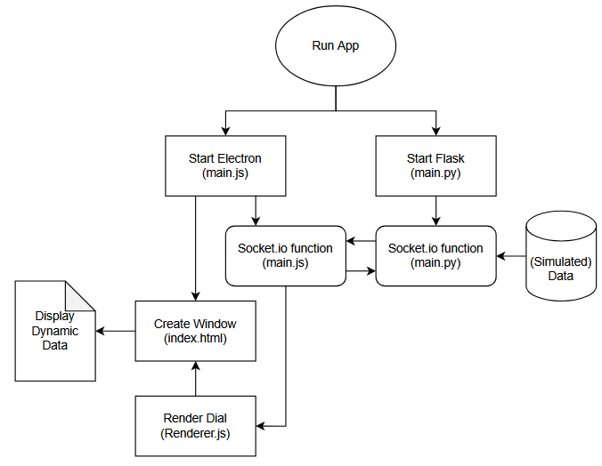

# UD Jet Engine Simulation UI #
## Department of Computer Science, University of Dayton
## Team 03: Andrew Reardon, Alex Ivary, Kyle Langenderfer, Ian Hemphill ##

Repository for the UDayton Jet Engine Simulation User Interface development. 
Latest update: 2/13/2025

## Sponsor: Billy Dolan ##

Billy is currently an Aerospace Engineering Graduate student at the University of Dayton, having graduated in Spring 2024. He currently helps out with the jet engine simulation program as a specialist, as well as taking the time to re-engineer programs in order to improve the current application used to test jet engines. His LinkedIn profile can be found [here](https://www.linkedin.com/in/billy1dolan).

## Task Description ##

We have been tasked with creating and designing a complete user interface for the current jet engine simulation application that is being used by Dayton's School of Engineering with the help of Billy due to converting the previous code from VB6 to Python for our new application. The requirements are as follows:
* Home Page
* Log Data Page
* Show Real Values Page
* ECU Parameter Edit Page
* GSU Test Functions Page

## Design Overview ##

## Technical Details ##

We are using the following tech stack in order to get real time updates and communication from our connection, as well as being able to implement python into Node.js:
* Electron
* Python
* Socket.io
* Flask Server
* Axios

## Current Progress ##

We currently have: 
* Working prototype test app
* Demo dial to display real time updates in data
* Customized buttons and menu/tool bar
* Resizable application window
* Exit button to fix full screen issues

## Demo

A link to our demo video can be found [here](https://udayton.zoom.us/rec/share/WPXGRFI82T_iislkcQN2vsJU2b3CUD3qsgw-891RbAr2nZMx18z4CXUpfOnmDf_w.fDCX5Y2nyo6igBmA?startTime=1741896008000)

## Website

Our website can be found at [https://hemphilli1.github.io/group03-jetsim/]

